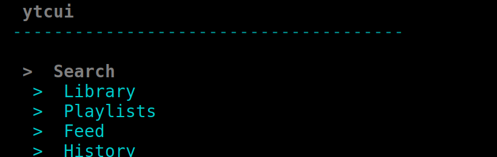
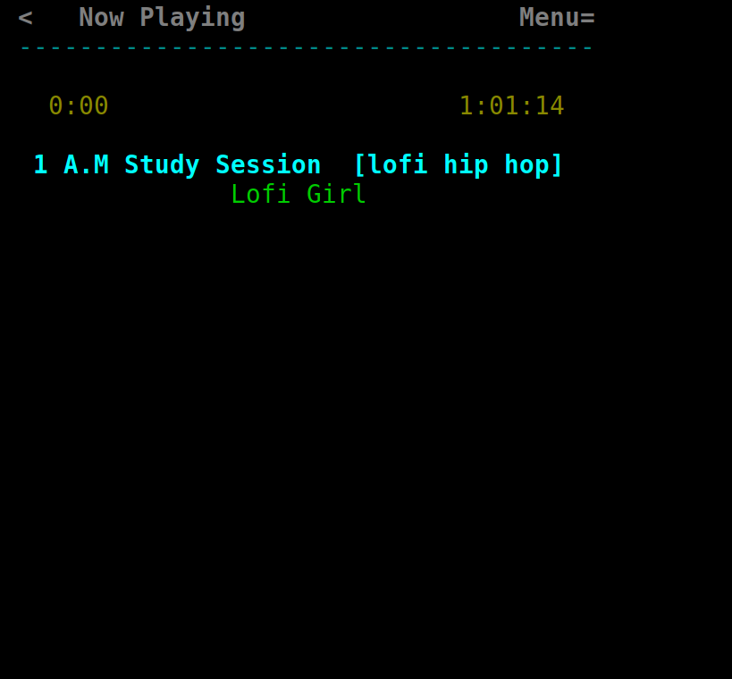
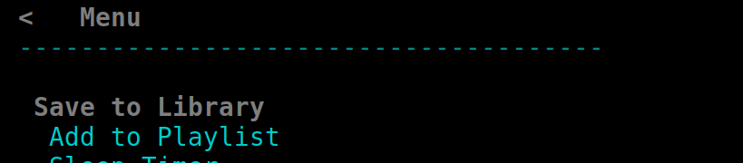
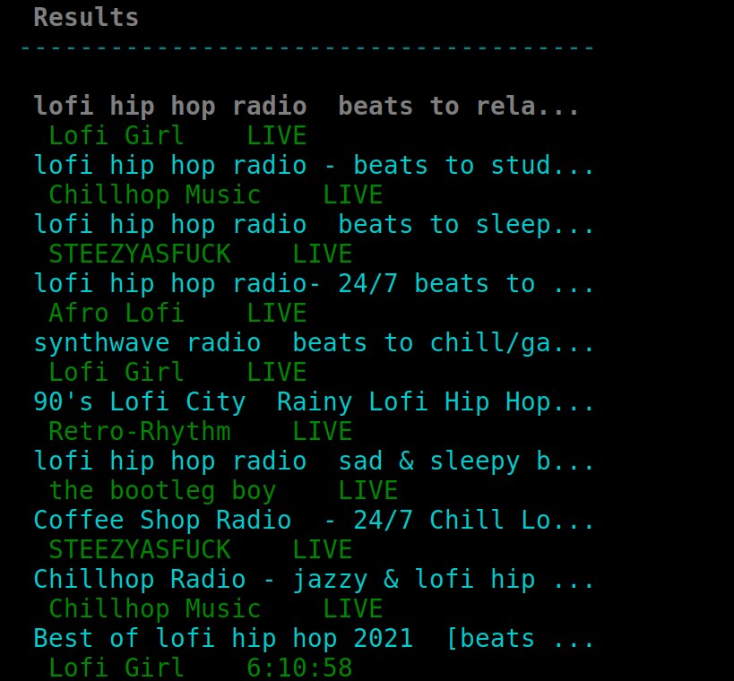
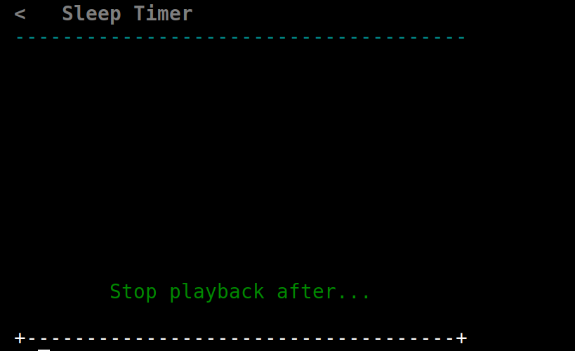

# ytcui-android (=^･ω･^=)

A terminal YouTube music player for your phone — search, tap a song, lock
your screen, fall asleep. Runs entirely inside Termux, no root, nothing
else to install.

This is the Termux/Android build of **[ytcui](https://github.com/MilkmanAbi/ytcui)** —
same engine, same InnerTube backend (**[ytcui-dl](https://github.com/MilkmanAbi/ytcui-dl)**,
bundled in `tools/`), same installer (**[OIS v4](https://github.com/MilkmanAbi/OneInstallSystem)**) —
but this one is **streamlined mode only**, always audio, and built to
survive you locking your phone and walking away.

<p align="center">
  
</p>

> the whole app. that's it. that's the UI. ( ˘ ³˘)♥

---

## Install

```sh
pkg update && pkg install -y git && git clone https://github.com/MilkmanAbi/ytcui-termux && cd ytcui-termux && sh install.sh --user
```

That's the one-liner. `apt install` works identically everywhere you see
`pkg install` below — Termux's `pkg` is just its own frontend over the
same apt/dpkg database, so either command reaches the same packages.

The installer detects Termux automatically (`$TERMUX_VERSION`, exported by
every Termux session), never asks for or needs `sudo` — Termux has no root
and doesn't want one — and installs unprivileged straight into `$PREFIX`.
`./install.sh --system` will correctly refuse and tell you to use `--user`
instead, since there's no root to elevate to on Termux at all.

Manage your install afterwards the same way ytcui always has:

```sh
ytcui --ois            # status + update panel
ytcui --update         # update to the latest version
ytcui --uninstall      # remove cleanly
```

---

## Why this exists

Regular ytcui auto-detects a narrow terminal and *offers* you the
streamlined music-player layout. On a phone that's backwards — there's no
"wide" case worth a full-UI code path, and mpv has nowhere to put a video
window without extra X11 setup anyway. So this build just skips the
question, and then goes further: it's not a shrunk-down copy of the
desktop UI, it's built as a phone app that happens to run in a terminal.

- **Streamlined UI, always. Audio-only, always.** Forced at two separate
  points (constructor and the per-frame UI resolver) — config.json, a
  stray `--mode`, terminal width, none of it matters. Tapping a result
  plays it directly; the video/audio picker screen is skipped entirely.
- **Navigate by touch alone — no Ctrl, no relying on a hardware Esc.**
  Every screen (except the root menu) gets a tappable **‹** in the header;
  screens with an actual video in view (Browse-with-a-result-selected,
  Now Playing) also get **Menu≡**. That's the whole navigation model —
  tap the row you want, tap ‹ to go back, tap Menu≡ for anything else.
  `Ctrl-S` (theme/accelerator settings) still technically works if you
  have a physical keyboard, but nothing essential depends on it anymore.
- **Save and Add to Playlist — actually reachable this time.** These
  existed in normal mode's action menu the whole time; streamlined mode
  never surfaced them at all. Menu≡ opens a compact sheet: **Save to
  Library**, **Add to Playlist** (existing ones, or type a name for a new
  one on the spot), **Sleep Timer...** — all wired to the same
  `Library` calls normal mode uses, not reimplemented.
- **Real transport controls, not a single catch-all tap.** The Now
  Playing screen's **◀◀ ‖ ▶▶** row is pinned to a fixed position and each
  symbol is its own tap target (seek −10s / pause·resume / seek +10s).
  Tapping anywhere else on the card still pauses too — the "tap the
  album art" gesture every phone music app trained you to expect.
- **An in-app sleep timer you can set without relaunching anything.**
  Menu≡ → Sleep Timer, type `45m` or `1h30m` or `2h` or bare `90`
  (minutes), hit ⏎. Live countdown on the Now Playing screen, no need to
  have started the CLI flag ahead of time — set it, change it, mid-track.
- **The soft keyboard actually shows up where you need it.** SGR mouse
  click-reporting (needed for every tap above) means Termux never sees a
  plain touch, which is also what its on-screen keyboard needs to appear.
  The three screens that take free-form typing — Search, naming a new
  playlist, the sleep timer — turn mouse capture off while active and
  back on the moment you leave; `TUI::set_mouse_capture()`, toggled from
  the per-frame loop on screen transitions. (One real consequence: the
  header ‹ can't be tappable on those three screens either — there's no
  way to tell "tap the back label" from "tap anywhere" once mouse
  tracking is off. It's hidden there on purpose; physical Esc, or
  Termux's own Extra Keys ESC key, is genuinely the only way back on
  those three specifically.)
- **Survives you leaving.** Holds a `termux-wake-lock` for the whole
  session (base Termux, no separate Termux:API app needed) so Android
  doesn't suspend the CPU and kill playback when your screen locks.
  Released cleanly on quit, on Ctrl-C, or when a sleep timer elapses.

<p align="center">
  
  
</p>

> real playback (mpv, no video output), real header, real transport taps (=^･ω･^=)

<p align="center">
  
</p>

> real InnerTube search results, rendered clean, no thumbnails needed >_<

---

## Falling asleep to it

Two ways to set a timer — pick whichever fits the moment.

From the shell, before you even open the app:

```sh
ytcui --sleep-timer 45      # streamlined, audio-only, stops and exits after 45 minutes
ytcui --audio-only           # no timer — stop it yourself whenever
```

`--sleep-timer` implies `--audio-only`.

Or, once you're already playing something, **Menu≡ → Sleep Timer**, type a
duration, hit ⏎ — no need to have planned ahead:

<p align="center">
  
</p>

> `45m` · `1h30m` · `2h` · bare `90` (minutes) — whatever's fastest to type half-asleep

Either way, the now-playing screen shows a live countdown, checked every
frame so the stop-and-goodnight message shows up the instant it hits
zero — not a frame late. When it elapses: playback stops, the wake lock
releases, and the app exits on its own. No timer means no auto-exit — quit
with `q` whenever you're done.

---

## What's in this repo

```
ytcui-android/
├── install.sh, ois/       — OIS v4 installer, patched for Termux
├── src/, include/          — ytcui itself (streamlined-only build)
└── tools/ytcui-dl/         — the standalone ytcui-dl CLI, bundled as a bonus
```

`ytcui` doesn't actually need `tools/ytcui-dl` at runtime — it vendors its
own header-only copy of the InnerTube resolver under `include/ytcui-dl/`
and links it straight in. The standalone CLI in `tools/` is there for
anyone who wants to script against it directly (pipe a stream URL into
something else, test a video ID from a shell script, whatever) —
build it separately:

```sh
cd tools/ytcui-dl && make && make install
```

---

## Building manually

```sh
pkg install clang ncurses openssl zlib make mpv
make            # builds ytcui itself
make install    # -> $PREFIX/bin, no root needed
```

`chafa` (thumbnails) is skippable — sleep mode doesn't render them anyway,
so leave it out for a leaner install unless you want album-art blocks in
the menus.

---

## Known gaps

This is still built and tested against a simulated Termux environment
(`$TERMUX_VERSION` simulated for every build/run-time path) rather than an
actual phone, same caveat as before — but round two of testing was after
round one's "tested with real evidence" claims here turned out to not
survive contact with an actual phone: the transport row's seek/pause/volume
and the sleep timer all had real bugs a simulated run alone hadn't caught.
So this round leaned harder on independently verifying against ground
truth instead of trusting what the app itself reports:
- Every playback claim below was checked by opening mpv's own IPC socket
  in parallel and reading `time-pos`/`pause`/`volume` directly, the same
  socket the app itself talks to -- not the app's own (possibly desynced)
  belief about its state.
- Bugs found and fixed this round: the waveform was rendered but never
  wired to seek at all (tap a position, mpv gets an absolute seek command,
  confirmed landing within the requested fraction of duration at three
  different offsets on a 6+ hour stream); rapid repeated
  pause/resume taps could desync the app's belief about pause state from
  mpv's actual state permanently (`is_paused()` now defers to mpv's own
  confirmed state instead of an optimistic local flag, 20 rapid cycles
  checked against the real IPC state with zero desyncs); default volume
  was 80%, changed to 100%; the sleep timer silently mis-parsed "1.5h" as
  15 hours and silently dropped the "30" in "1h30" -- both now rejected
  outright ("couldn't read that") instead of guessing wrong.
- The engine itself (`include/ytcui-dl/`, `tools/ytcui-dl/`) was a
  many-months-stale pre-rewrite snapshot, missing this project's move to
  an adaptive-stream-led client chain -- which is *why* seeking was
  unreliable enough to justify not offering it: mpv's demuxer can't do
  reliable time-based seeking against the old muxed-progressive-only pick.
  Both are now synced to the current ytcui-dl, which resolves adaptive
  audio by default; duration/position reporting over IPC and seeking both
  came back working as a direct result, not a separate fix.
- The mouse-capture-off fix (needed for Termux's keyboard to appear) was
  previously flagged as unverified for two of its three screens (naming a
  playlist, the sleep timer). The Sleep Timer path is now confirmed
  end-to-end: menu → tap Sleep Timer → keyboard-mode typing "10m" → Enter
  → countdown visibly ticking on Now Playing. Naming a new playlist uses
  the identical mechanism but wasn't independently re-run this round.

`open_in_browser` / `copy_to_clipboard` still shell out to `xdg-open` /
`xclip`, which don't exist on Termux. Not wired to `termux-open` /
`termux-clipboard-set` yet since those need the separate Termux:API app —
low priority for the sleep-mode use case specifically (you're not
browser-opening or clipboard-copying at 1am), but a real gap if you use
this for anything beyond falling asleep to it.

---

## License

MIT — same as ytcui, ytcui-dl, and OIS.

---

*Made with (=^･ω･^=), ncurses, and a phone that should really be charging
instead of running a terminal emulator at 1am.*

If you like this, please 🌟 it — makes me feel fuzzy and nice inside. ૮ ˶ᵔ ᵕ ᵔ˶ ა
